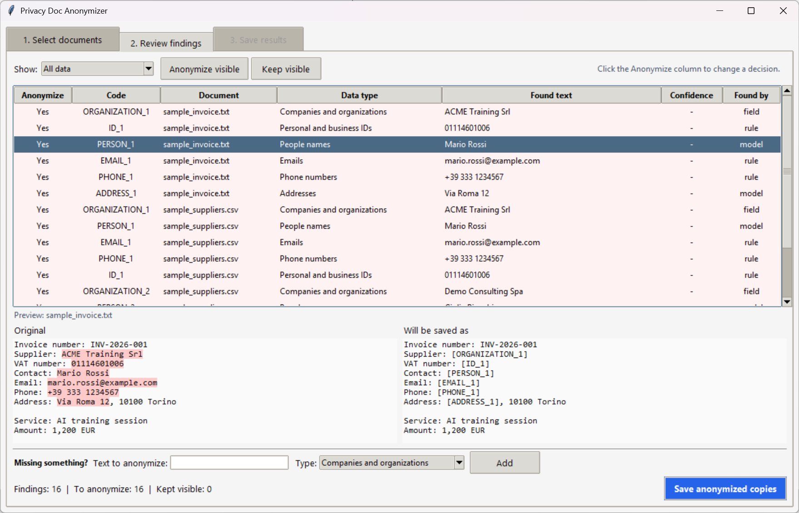
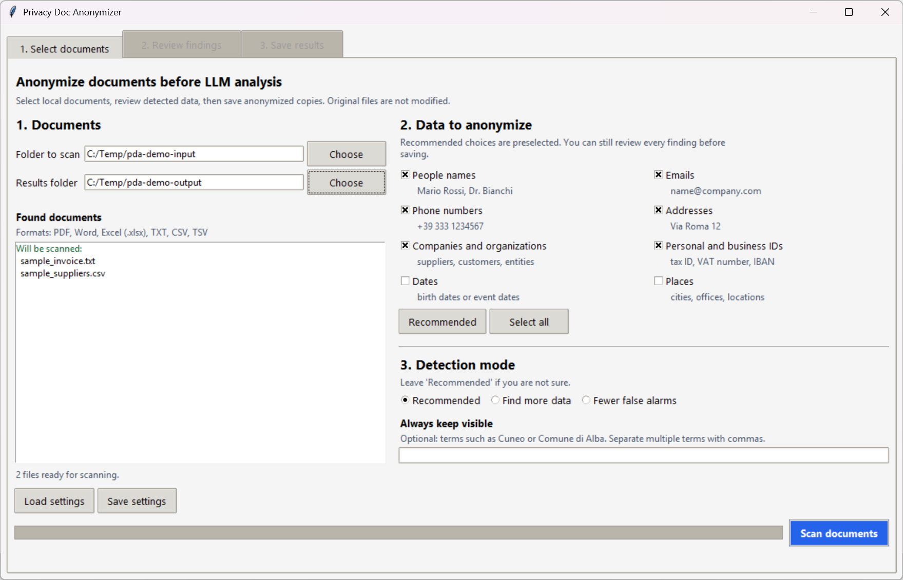
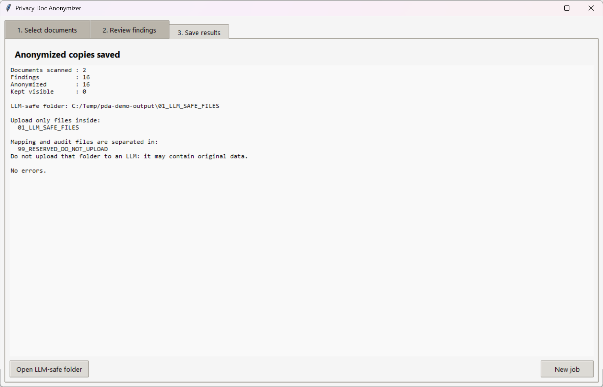

# Privacy Doc Anonymizer

[English version](README.md)

Applicazione desktop locale per anonimizzare documenti aziendali prima di usarli in workflow con LLM.

Il progetto e English-first per essere piu leggibile in un portfolio internazionale, ma include regole e documentazione pensate anche per documenti italiani. Nasce come applicazione pratica ispirata al rilascio di [OpenAI Privacy Filter](https://openai.com/index/introducing-openai-privacy-filter/), modello open-weight per rilevare e oscurare dati personali nel testo.

> Progetto indipendente, non affiliato a OpenAI.

## Demo

La demo usa solo dati sintetici.



<details>
<summary>Altri screenshot</summary>





</details>

## Perche E Utile

I modelli linguistici aiutano ad analizzare documenti, ma molti file aziendali contengono nomi, email, telefoni, indirizzi, codici fiscali, P.IVA, IBAN, fornitori e clienti.

L'app aiuta a creare un flusso piu sicuro:

1. scegli documenti locali;
2. rilevi possibili dati personali in locale;
3. controlli i risultati in una GUI semplice;
4. salvi solo file anonimizzati in una cartella sicura per l'LLM;
5. tieni mapping e log in una cartella riservata da non caricare.

## Funzionalita Principali

- Interfaccia desktop in Python e Tkinter, con testi principali in inglese.
- Regole italian-aware per codici fiscali, P.IVA, IBAN, indirizzi, fornitori e clienti.
- Integrazione con OpenAI Privacy Filter per il rilevamento PII.
- Revisione manuale prima del salvataggio.
- Formati supportati: PDF, DOCX, XLSX, TXT, CSV, TSV.
- Output separato:
  - `01_LLM_SAFE_FILES`: solo file anonimizzati.
  - `99_RESERVED_DO_NOT_UPLOAD`: mapping, indice audit e log.
- Placeholder coerenti tra file, per esempio `[PERSON_1]`, `[EMAIL_1]`, `[ORGANIZATION_1]`.
- Mapping locale per capire, in modo controllato, a quale dato originale corrisponde un placeholder.
- Test automatici su redazione, Excel, output separato e rilevamento fornitori.

## Flusso

```text
Documenti originali
        |
        v
Rilevamento locale + regole per documenti italiani
        |
        v
Revisione umana nella GUI desktop
        |
        +--> 01_LLM_SAFE_FILES
        |       file .txt anonimizzati
        |
        +--> 99_RESERVED_DO_NOT_UPLOAD
                mapping, indice audit, log
```

## Avvio Rapido

Windows:

```powershell
py -m venv .venv
.\.venv\Scripts\activate
py -m pip install --upgrade pip
py -m pip install -r requirements.txt
py -m pip install -r requirements-opf.txt
py check_environment.py
py gui.py
```

## Dati Demo

La cartella `examples/synthetic/` contiene solo dati sintetici. Non caricare nel repository documenti veri, fatture vere, output reali, mapping o screenshot con dati personali.

## Test

```powershell
py -m unittest discover -s tests -v
```

## Note Privacy

Questo progetto aiuta un workflow privacy-by-design, ma non e una garanzia legale di anonimizzazione.

Regole importanti:

- carica nell'LLM solo i file dentro `01_LLM_SAFE_FILES`;
- non caricare mai `99_RESERVED_DO_NOT_UPLOAD`;
- controlla sempre i risultati prima di condividere documenti;
- usa solo dati sintetici nel repository pubblico;
- non trattare il risultato come certificazione di conformita.

OpenAI descrive Privacy Filter come un componente di un sistema privacy-by-design piu ampio. Questa app mantiene infatti una revisione manuale e separa i file sicuri dal mapping riservato.

## Documentazione

- [Architettura](docs/architecture.it.md)
- [Modello privacy](docs/privacy-model.it.md)
- [Roadmap](docs/roadmap.it.md)

## Valore Portfolio

Il progetto mostra product thinking, workflow AI attenti alla privacy, processing documentale locale, sviluppo desktop Python, progettazione per utenti non tecnici e pratiche ingegneristiche testabili.

## Licenza

MIT. Vedi [LICENSE](LICENSE).
